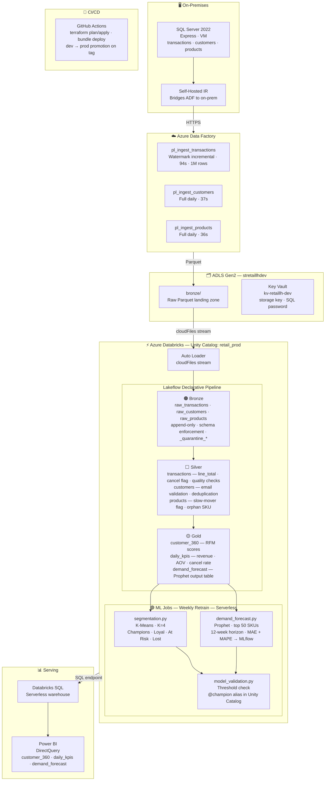

# Retail Customer 360 & Demand Forecasting Lakehouse

Azure data engineering project that ingests retail transaction data, processes it through a Bronze → Silver → Gold lakehouse on Databricks, and runs weekly ML jobs for customer segmentation and SKU-level demand forecasting.

**Pipeline runtime:** ~4 min (Lakeflow) · **ML retrain:** ~7 min (serverless compute)

---

## Architecture

> Full editable diagram: [`docs/architecture.drawio`](docs/architecture.drawio) — open at [diagrams.net](https://app.diagrams.net)



---

## Stack

| Layer | Technology |
|---|---|
| Source | SQL Server 2022 Express, UCI Online Retail II dataset |
| Ingestion | Azure Data Factory, Self-Hosted Integration Runtime |
| Storage | ADLS Gen2, Delta Lake |
| Processing | Azure Databricks, Spark, Lakeflow Declarative Pipelines |
| Governance | Unity Catalog, Delta constraints, quarantine tables |
| ML | MLflow (Unity Catalog registry), scikit-learn K-Means, Prophet |
| IaC | Terraform (ADLS, ADF, Key Vault, Databricks cluster policy) |
| CI/CD | GitHub Actions, Databricks Declarative Automation Bundles |
| Serving | Databricks SQL, Power BI |

---

## Repository Structure

```
retail-lakehouse/
├── infra/                        Terraform — Azure infrastructure
│   ├── main.tf
│   ├── modules/storage/          ADLS Gen2 + containers
│   ├── modules/adf/              Data Factory + SHIR
│   └── modules/keyvault/         Secrets management
│
├── adf/                          ADF pipeline JSON definitions
│   ├── pl_ingest_transactions.json
│   ├── pl_ingest_customers.json
│   ├── pl_ingest_products.json
│   └── linked_services/
│
├── databricks/                   Declarative Automation Bundle
│   ├── databricks.yml            dev + prod targets
│   └── src/
│       ├── bronze/autoloader_ingest.py
│       ├── silver/transactions.py · customers.py · products.py
│       ├── gold/customer_360.py · daily_kpis.py · demand_forecast_table.py
│       └── ml/segmentation.py · demand_forecast.py · model_validation.py
│
├── data/setup/                   Local data preparation scripts
├── tests/                        Unit tests (pytest + PySpark)
└── .github/workflows/
    ├── terraform.yml             PR → plan, merge → apply
    └── databricks_deploy.yml     Push → validate → deploy → promote
```

---

## Setup

### Prerequisites
- Azure subscription with Contributor access
- Databricks workspace (Premium tier for Unity Catalog)
- Azure CLI, Terraform, Databricks CLI installed

### 1. Provision Azure Infrastructure

```bash
cd infra
terraform init
terraform apply
# Creates: ADLS Gen2, ADF, Key Vault, Databricks cluster policy
```

Install the Self-Hosted Integration Runtime on the SQL Server VM:
```powershell
powershell -ExecutionPolicy Bypass -File infra/reinstall_shir.ps1
```

### 2. Seed Bronze Data

```bash
# Uploads sample Parquet files to ADLS Gen2 bronze container
python infra/seed_bronze_data.py
```

### 3. Deploy and Run the Pipeline

```bash
cd databricks
databricks bundle deploy --target dev
databricks bundle run daily_pipeline_job --target dev
```

The Lakeflow pipeline runs Bronze → Silver → Gold in sequence (~4 min).

### 4. Run the ML Retrain Job

```bash
databricks bundle run ml_retrain_job --target dev
```

Tasks run in order: segmentation → demand forecast → model validation (~7 min).  
Both models are registered in Unity Catalog MLflow and the `@champion` alias is set on passing versions.

### 5. Deploy Infrastructure Changes via CI/CD

Push to `main` triggers:
- `terraform.yml` — plans and applies any infra changes
- `databricks_deploy.yml` — validates bundle, deploys to dev, runs smoke tests

Required GitHub Actions secrets:

| Secret | Description |
|---|---|
| `AZURE_CLIENT_ID` | Service principal app ID |
| `AZURE_CLIENT_SECRET` | Service principal secret |
| `AZURE_SUBSCRIPTION_ID` | Azure subscription ID |
| `AZURE_TENANT_ID` | Azure tenant ID |
| `DATABRICKS_HOST` | Workspace URL |
| `DATABRICKS_TOKEN` | Databricks PAT |
| `TF_VAR_sql_server_password` | SQL Server admin password |

---

## ML Models

**Customer Segmentation (K-Means, K=4)**  
Clusters customers by RFM scores (Recency, Frequency, Monetary). Segment labels are assigned by centroid ranking — Champions sit highest on all three axes, Lost Customers lowest. Silhouette score is logged per run; `@champion` alias is only set if score ≥ threshold.

**Demand Forecasting (Prophet)**  
Trains one Prophet model per SKU for the top 50 SKUs by transaction volume. Uses multiplicative seasonality with yearly and weekly components. Forecast horizon is 12 weeks. Mean MAPE across all SKUs is logged to MLflow.

Both models use the Unity Catalog MLflow registry. The `validate_and_promote` job checks metric thresholds before setting the `@champion` alias — failed models stay as unaliased versions and don't affect serving.

---

## Tests

```bash
pip install pytest pyspark delta-spark
pytest tests/ -v
```

Covers: revenue calculation logic, customer deduplication, null handling in silver transformations.

---

## Data Source

UCI Online Retail II — E. Agyemang et al. (2022). UCI Machine Learning Repository.  
Licensed under CC BY 4.0. Supplemented with synthetic customer and product data.
